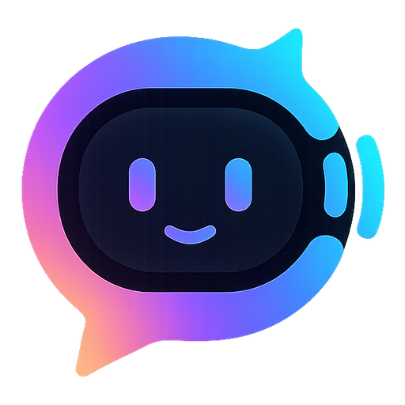

<p align="center">
  
</p>

<h1 align="center">Prepzi-AI</h1>

<p align="center">
  <strong>Get interview-ready with AI-powered mock interviews, real-time voice conversation, and detailed feedback.</strong>
</p>

<p align="center">
  <a href="#features">Features</a> ·
  <a href="#tech-stack">Tech Stack</a> ·
  <a href="#how-it-works">How It Works</a> ·
  <a href="#getting-started">Getting Started</a> ·
  <a href="#project-structure">Project Structure</a> ·
  <a href="#api-reference">API Reference</a> ·
  <a href="#security-notes">Security Notes</a>
</p>

---

## Overview

Prepzi-AI is a full-stack mock interview platform that simulates a real hiring
process end to end. A candidate picks a role, seniority level, and tech
stack, and the app generates a complete three-round interview: a timed
quantitative aptitude test, a voice-based technical interview, and a
voice-based behavioral interview — each conducted by an AI interviewer that
listens, responds, and reacts to what the candidate actually says. At the
end, the candidate receives a single combined feedback report scored and
weighted across all three rounds, with specific, evidence-based comments
tied to what they actually said in the transcript.

## Features

- **Three-round interview pipeline** — quantitative aptitude (MCQs, timed,
  auto-scored), a technical voice interview, and a behavioral voice interview,
  run back-to-back as one continuous session.
- **Real-time voice conversation** — the AI interviewer speaks using
  natural-sounding neural text-to-speech and listens via the browser's speech
  recognition, reacting to the candidate's previous answer before asking the
  next question (not just reading questions off a script).
- **Detailed, evidence-based feedback** — feedback is generated per category
  (communication, technical knowledge, problem solving, cultural fit,
  confidence) and is required to cite specific questions and answers from the
  transcript rather than giving generic verdicts.
- **Session-based authentication** — Firebase Authentication on the client,
  verified server-side via secure httpOnly session cookies (no tokens sitting
  in local storage).
- **Take, retake, and review** — every interview a user creates or completes
  is tracked separately ("Your Interviews" vs. "Attended Interviews"), with
  full feedback history preserved.
- **Light/dark theme** — a full theme toggle built on CSS custom properties,
  persisted across sessions.

## Tech Stack

| Layer | Technology |
|---|---|
| Frontend framework | Next.js 16 (App Router), React 19, TypeScript |
| Styling | Tailwind CSS v4, custom design tokens, `next-themes` |
| Forms & validation | `react-hook-form`, `zod` |
| Auth (client) | Firebase Authentication (email/password) |
| Backend framework | FastAPI (Python) |
| Database | Firestore (Firebase Admin SDK) |
| LLM (questions & feedback) | Groq API (Llama 3.3 70B) |
| Text-to-speech | `edge-tts` (Microsoft neural voices, no API key required) |
| Session management | Server-issued httpOnly session cookies via Firebase session cookies |

## How It Works

Every interview a user creates runs through three rounds, in order:

1. **Round 1 — Quantitative Aptitude.** 10 (or 25/60) timed multiple-choice
   questions covering arithmetic, logical reasoning, and data interpretation.
   60 seconds per question, auto-scored client-side.
2. **Round 2 — Technical Interview.** A voice conversation with an AI
   interviewer in a focused, professional tone, covering the candidate's
   chosen role and tech stack. The interviewer reacts to each answer in real
   time before moving to the next question.
3. **Round 3 — Behavioral Interview.** A warmer, HR-style voice conversation
   covering past experience, soft skills, and culture fit.

After all three rounds, the transcripts (and the aptitude score) are sent to
the backend, which generates one combined feedback report — weighted 20%
aptitude / 45% technical / 35% behavioral — with a per-category score,
specific strengths, specific areas for improvement, and a final assessment.

## Getting Started

### Prerequisites

- Node.js 18+ and npm
- Python 3.10+
- A Firebase project with **Authentication** (Email/Password provider) and
  **Firestore** enabled
- A [Groq API key](https://console.groq.com)

### 1. Clone the repository

```bash
git clone https://github.com/Thirumalai-Nambi-S/Prepzi-AI.git
cd Prepzi-AI
```

### 2. Backend setup

```bash
cd backend
python3 -m venv venv
source venv/bin/activate        # Windows: venv\Scripts\activate
pip install -r requirements.txt
cp .env.example .env
```

Fill in `backend/.env`:

```env
GROQ_API_KEY=your_groq_api_key
GROQ_MODEL=llama-3.3-70b-versatile

# Path to a Firebase service account JSON (Firebase Console > Project
# Settings > Service Accounts > Generate new private key)
FIREBASE_SERVICE_ACCOUNT_FILE=./firebase-service-account.json

SESSION_COOKIE_NAME=session
SESSION_EXPIRES_DAYS=7
CORS_ORIGINS=http://localhost:3000
ENVIRONMENT=development
```

Run the API:

```bash
python -m uvicorn app.main:app --reload
```

The API is now available at `http://localhost:8000`.

### 3. Frontend setup

```bash
cd frontend
npm install
cp .env.local.example .env.local
```

Fill in `frontend/.env.local` with your Firebase **web app** config (Firebase
Console > Project Settings > General > Your apps):

```env
NEXT_PUBLIC_FIREBASE_API_KEY=
NEXT_PUBLIC_FIREBASE_AUTH_DOMAIN=
NEXT_PUBLIC_FIREBASE_PROJECT_ID=
NEXT_PUBLIC_FIREBASE_STORAGE_BUCKET=
NEXT_PUBLIC_FIREBASE_MESSAGING_SENDER_ID=
NEXT_PUBLIC_FIREBASE_APP_ID=
NEXT_PUBLIC_FIREBASE_MEASUREMENT_ID=
```

Run the dev server:

```bash
npm run dev
```

Open [http://localhost:3000](http://localhost:3000). The frontend proxies all
`/api/*` requests to the FastAPI backend (see `next.config.ts`), so both
servers need to be running together for the app to work.

## Project Structure

```
Prepzi-AI/
├── backend/
│   ├── app/
│   │   ├── main.py              # FastAPI app entrypoint, CORS, router mounting
│   │   ├── config.py            # Environment-driven settings
│   │   ├── deps.py              # Auth dependencies (session verification)
│   │   ├── firebase_setup.py    # Firebase Admin SDK initialization
│   │   ├── groq_client.py       # LLM prompts: questions, feedback, transitions
│   │   ├── schemas.py           # Pydantic request/response models
│   │   └── routers/
│   │       ├── auth.py          # Sign up / sign in / sign out / session check
│   │       ├── interviews.py    # Generate, list, feedback endpoints
│   │       └── tts.py           # Text-to-speech endpoint
│   └── requirements.txt
└── frontend/
    ├── app/
    │   ├── (auth)/               # Sign-in / sign-up routes
    │   └── (root)/               # Authenticated app: home, interview flow, feedback
    ├── components/               # Agent (voice), AptitudeRound, InterviewCard, etc.
    ├── lib/                      # API client, Firebase client, voice-agent hook
    ├── firebase/                 # Firebase client SDK initialization
    └── types/                    # Shared TypeScript types
```

## API Reference

All endpoints are prefixed and proxied through the Next.js frontend at
`/api/*`. See the [official documentation](./PREPZI-AI-DOCUMENTATION.docx)
for full request/response schemas. Summary:

| Method | Endpoint | Description |
|---|---|---|
| POST | `/api/auth/sign-up` | Create a user record in Firestore |
| POST | `/api/auth/sign-in` | Exchange a Firebase ID token for a session cookie |
| POST | `/api/auth/sign-out` | Clear the session cookie |
| GET | `/api/auth/me` | Return the currently authenticated user |
| POST | `/api/interviews/generate` | Generate a full 3-round interview |
| GET | `/api/interviews/mine` | Interviews created by the current user |
| GET | `/api/interviews/latest` | Interviews available to take |
| GET | `/api/interviews/attended` | Interviews the current user has completed |
| GET | `/api/interviews/{id}` | Fetch a single interview |
| POST | `/api/interviews/turn-transition` | AI reaction line between questions |
| POST | `/api/interviews/{id}/full-feedback` | Submit all 3 round transcripts, get combined feedback |
| GET | `/api/interviews/{id}/feedback` | Fetch existing feedback for an interview |
| POST | `/api/tts` | Synthesize speech for interviewer dialogue |

## Security Notes

- Session cookies are `httponly`, `samesite=lax`, and `secure` in production
  — never exposed to client-side JavaScript.
- Firebase Admin credentials and the Groq API key live only in
  `backend/.env`, which is git-ignored.
- The Firebase **web** API key (`NEXT_PUBLIC_FIREBASE_API_KEY`) is
  client-side by design per Firebase's own documentation — it identifies the
  project, it does not grant access on its own. Real authorization is
  enforced by Firestore Security Rules and by the backend's session
  verification, not by hiding this value.
- Restrict the Firebase browser API key in Google Cloud Console (HTTP
  referrers + API restrictions) as a defense-in-depth measure against quota
  abuse.

## License

This project is provided as-is for educational and personal portfolio use.